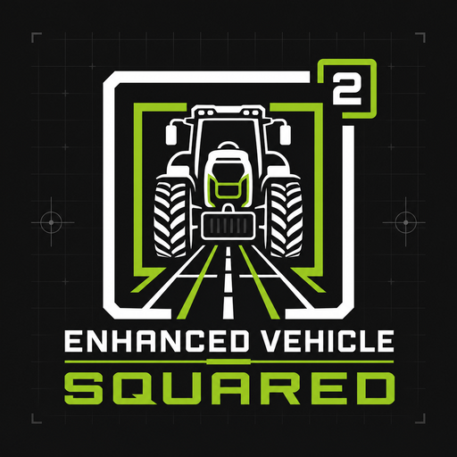

# Enhanced Vehicle Squared

[](https://github.com/user01010111/FS25_EnhancedVehicleSquared/actions/workflows/validate.yml)
[](#compatibility)
[](LICENSE)

Enhanced Vehicle Squared is the independently maintained continuation of the
vehicle-control and guidance mod for Farming Simulator 25. It provides track
guidance, drivetrain controls, grouped implement actions, and a more useful
vehicle HUD.

[Releases](https://github.com/user01010111/FS25_EnhancedVehicleSquared/releases) ·
[Report an issue](https://github.com/user01010111/FS25_EnhancedVehicleSquared/issues) ·
[Roadmap](ROADMAP.md) · [Contributing](CONTRIBUTING.md) ·
[Attribution](ATTRIBUTION.md)



## Why Squared exists

The original project was discontinued, archived, and made read-only by its
owner on 17 July 2026. Its last substantive code release was on 15 October
2025, about 275 days earlier. On the day of archival, the remaining
pull requests were closed without merge and the remaining issues were closed
as not planned. The repository also received an explicit development-stopped
notice.

Taken together, those actions left users without an upstream maintenance path.
Enhanced Vehicle Squared therefore treats the original project as abandoned
for maintenance purposes. We have cancelled all upstream-contribution plans
and will develop, review, test, and release changes from this repository.
The detailed lineage and evidence links are recorded in [ATTRIBUTION.md](ATTRIBUTION.md).

## Installation

1. Download `FS25_EnhancedVehicle.zip` from the
   [latest release](https://github.com/user01010111/FS25_EnhancedVehicleSquared/releases).
2. Copy the ZIP into the Farming Simulator 25 `mods` directory. Do not extract
   or rename it.
3. Enable **Enhanced Vehicle Squared** when loading a savegame.

Replace an existing `FS25_EnhancedVehicle.zip` in place. Do not install the old
and new releases side by side.

### Why the ZIP still has the old name

Farming Simulator uses the ZIP basename as the technical mod identity. Squared
intentionally retains `FS25_EnhancedVehicle.zip`, the existing Lua identifiers,
input-action names, savegame keys, and `modSettings/FS25_EnhancedVehicle`
configuration path. These are compatibility interfaces, not current branding.
Keeping them preserves existing savegames, custom key bindings, multiplayer mod
identity, configuration, and third-party integrations.

## Compatibility

Enhanced Vehicle Squared 2.0.0.0 requires Farming Simulator 25 version
1.20.0.0 or newer. The project and all distributed user-facing text are English
only. Console releases are not supported.

## What changed in 2.0.0.0

- Established the independent Enhanced Vehicle Squared identity and release
  line
- Added transactional licensed-test cleanup and protected mod-settings handling
- Added strict structured test markers and exact source/archive comparison
- Corrected guidance offset wrapping at track boundaries
- Corrected grouped fold controls using Farming Simulator fold contracts
- Corrected grass and headland ground-type classification
- Made current-versus-legacy configuration precedence deterministic
- Added verified configuration migration with malformed-file preservation
- Classified dedicated processes early and prevented dedicated configuration
  file access
- Isolated client-only HUD, GUI, sound, and renderer resources from dedicated
  servers
- Reduced distributed language content to plain English

## Features

- Direction snap and track guidance with configurable working width and offset
- Headland actions and selectable turnover tracks
- Parking brake, front/rear differential locks, and 2WD/4WD selection
- Grouped front/rear implement controls
- HUD data for damage, fuel, RPM, temperature, mass, odometer, trip meter,
  drivetrain state, and guidance state
- Rebindable controls through the in-game input settings

## Default controls

All controls can be changed through the in-game input settings.

<details>
<summary><strong>Show default keyboard controls</strong></summary>

| Key | Action |
| --- | --- |
| <kbd>R Ctrl</kbd> + <kbd>Num /</kbd> | Open the Enhanced Vehicle Squared settings |
| <kbd>Num Enter</kbd> | Apply or release the parking brake |
| <kbd>R Ctrl</kbd> + <kbd>End</kbd> | Snap to the current direction or track |
| <kbd>R Ctrl</kbd> + <kbd>Home</kbd> | Reverse the guidance direction by 180° |
| <kbd>R Shift</kbd> + <kbd>Home</kbd> | Change guidance mode; hold for one second to disable guidance |
| <kbd>R Ctrl</kbd> + <kbd>Num 1</kbd> | Recalculate working width |
| <kbd>R Ctrl</kbd> + <kbd>Num 2</kbd> | Recalculate the track layout |
| <kbd>R Ctrl</kbd> + <kbd>Num 3</kbd> | Cycle guidance-line display modes |
| <kbd>R Ctrl</kbd> + <kbd>Num 4</kbd> / <kbd>Num 6</kbd> | Decrease/increase turnover tracks |
| <kbd>R Ctrl</kbd> + <kbd>Num -</kbd> / <kbd>Num +</kbd> | Move the track layout left/right |
| <kbd>R Ctrl</kbd> + <kbd>R Shift</kbd> + <kbd>Num -</kbd> / <kbd>Num +</kbd> | Move the in-track offset left/right |
| <kbd>R Shift</kbd> + <kbd>Num -</kbd> / <kbd>Num +</kbd> | Decrease/increase track width |
| <kbd>R Ctrl</kbd> + <kbd>Insert</kbd> / <kbd>Delete</kbd> | Move one track right/left |
| <kbd>R Ctrl</kbd> + <kbd>Page Up</kbd> / <kbd>Page Down</kbd> | Change direction by 1° |
| <kbd>R Shift</kbd> + <kbd>Page Up</kbd> / <kbd>Page Down</kbd> | Change direction by 45° |
| <kbd>R Ctrl</kbd> + <kbd>R Shift</kbd> + <kbd>Page Up</kbd> / <kbd>Page Down</kbd> | Change direction by 0.25° |
| <kbd>R Ctrl</kbd> + <kbd>Num *</kbd> | Cycle headland modes |
| <kbd>R Shift</kbd> + <kbd>Num /</kbd> / <kbd>Num *</kbd> | Cycle headland distances |
| <kbd>R Ctrl</kbd> + <kbd>Num 5</kbd> | Toggle odometer/trip meter; hold to reset the trip meter |
| <kbd>R Ctrl</kbd> + <kbd>Num 7</kbd> | Toggle the front differential lock |
| <kbd>R Ctrl</kbd> + <kbd>Num 8</kbd> | Toggle the rear differential lock |
| <kbd>R Ctrl</kbd> + <kbd>Num 9</kbd> | Toggle 2WD/4WD |
| <kbd>L Alt</kbd> + <kbd>1</kbd> / <kbd>2</kbd> | Raise/lower or start/stop rear implements |
| <kbd>L Alt</kbd> + <kbd>3</kbd> / <kbd>4</kbd> | Raise/lower or start/stop front implements |
| <kbd>L Alt</kbd> + <kbd>5</kbd> / <kbd>6</kbd> | Fold/unfold rear or front implements |

</details>

## Known limitations

- Fuel-consumption and engine-temperature values may be inaccurate for
  non-host players because the GIANTS Engine does not synchronize every
  required value.
- Automated networking checks simulate protocol behavior. The 2.0.0.0 release
  candidate has licensed local client and dedicated-server coverage, but not a
  genuine multi-machine multiplayer session.
- Subjective visuals still require human review even where screenshot checks
  cover line continuity and placement.

## Support

Report reproducible problems through
[GitHub Issues](https://github.com/user01010111/FS25_EnhancedVehicleSquared/issues).
Include the game version, Squared version, single-player or multiplayer mode,
other active mods, and the relevant portion of `log.txt`.

## Build and validation

The source repository contains automated tests and licensed-test tooling. None
of those files are included in the production ZIP. The archive is generated
from an explicit runtime manifest with fixed ordering, timestamps, permissions,
and byte-for-byte source payload checks.

Python 3 and Lua 5.1 are required:

```sh
LUA=lua5.1 LUAC=luac5.1 scripts/validate.sh
```

This creates `build/FS25_EnhancedVehicle.zip`. Every release tag must exactly
match the version in `modDesc.xml`; the release workflow publishes the archive
validated in that same workflow and its SHA-256 checksum.

## License and attribution

Enhanced Vehicle Squared is an adapted work released under the
[Creative Commons Attribution-NonCommercial-ShareAlike 4.0 International
License](LICENSE). Commercial use is not permitted, and adaptations must remain
under the same or a compatible ShareAlike license.

Required original-work credit, source identity, modification notices, retained
historical contributor credit, and the no-endorsement statement are in
[ATTRIBUTION.md](ATTRIBUTION.md). Both that file and the full license are also
included inside every production ZIP.
